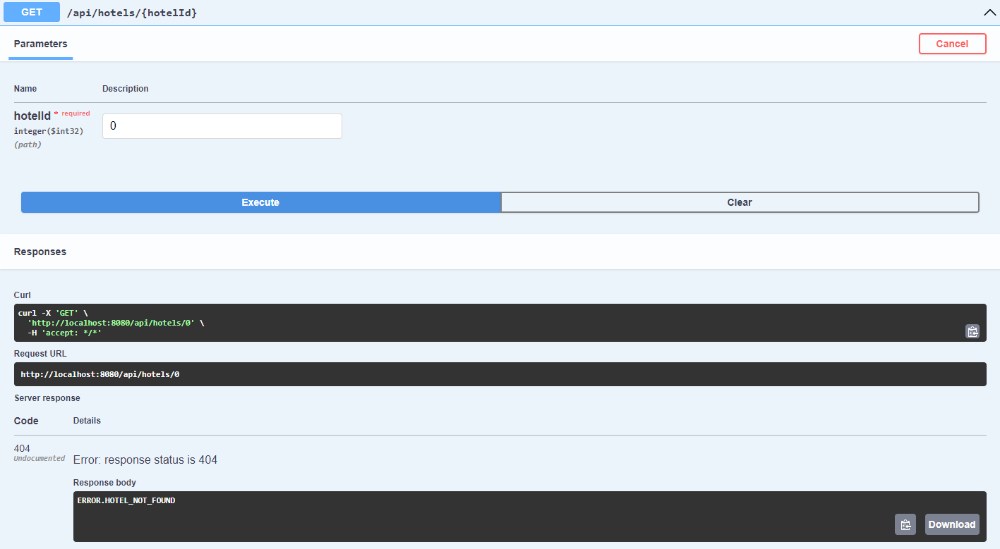

## Description
Develop an API for hotel reservation system using Java Springboot.

### Get a list of hotels
GET /api/hotels

### Get a specific hotel
GET /api/hotels/{hotelId}
 

Success

Fail

### Create a new hotel
POST /api/hotels

## Technologies

SpringBoot
 
H2 Database (Embedded Persistence Mode)
 
Liquibase: version control for database
 
Lombok
 
Swagger (access at http://localhost:8080/swagger-ui/index.html)